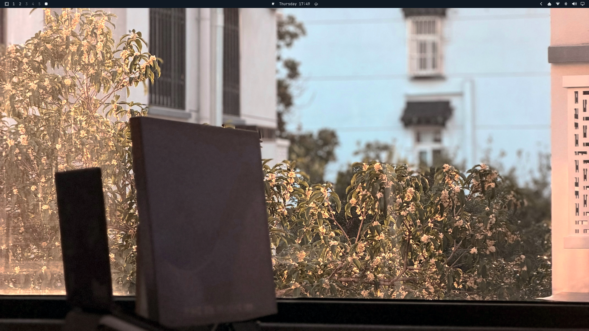
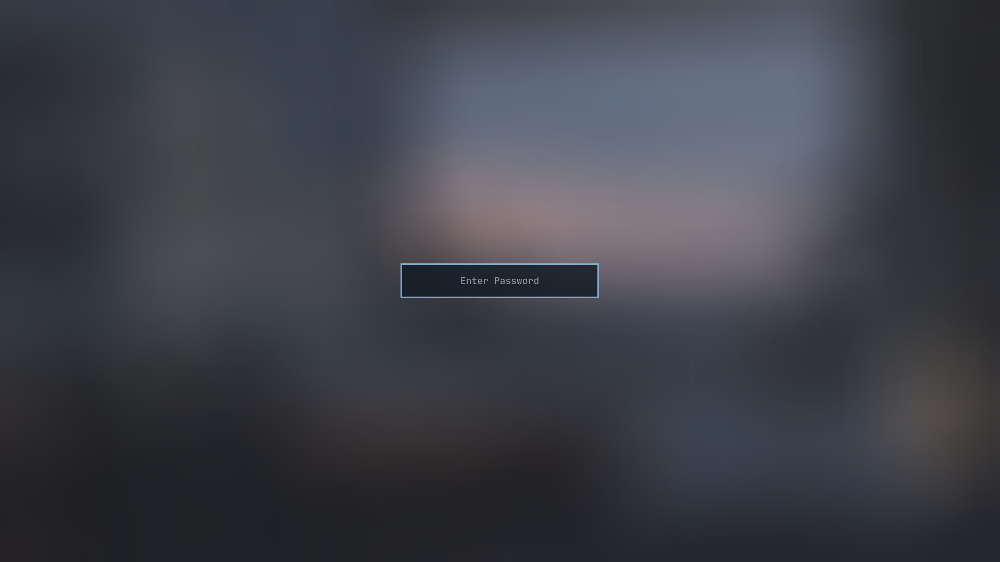

# Omarchy Ankh Dark

Tema escuro para Omarchy v4. É a variante noturna do Ankh, com azul-marinho,
marfim frio e azul ardósia.

## Instalação

~~~bash
omarchy theme install https://github.com/PedroAugustoOK/omarchy-ankh-dark-theme
omarchy theme set ankh-dark
~~~

Para trocar o wallpaper:

~~~bash
omarchy theme bg next
~~~

A versão clara está em
[Omarchy Ankh](https://github.com/PedroAugustoOK/omarchy-ankh-theme).

## Inclui

- Paleta em colors.toml para Omarchy, terminal, editores e aplicativos
  suportados pelo sistema.
- shell.toml para barra, menus, notificações, polkit, lockscreen e seletor de
  wallpapers.
- Ícones Yaru Blue.
- Tema do btop.
- Quatro wallpapers PNG em 3840×2160.
- Capturas reais do desktop e da tela de bloqueio.

## Tela de bloqueio

O campo de senha segue o layout padrão do Omarchy.

## Wallpapers

| Arquivo | Cena |
| --- | --- |
| 01-ankh-study.png | Mesa, janela e vegetação |
| 02-ankh-meadow.png | Estudo aberto para o campo |
| 03-ankh-window.png | Mesa clara, caderno e laptop |
| 04-omarchy-wordmark.png | Wordmark oficial em fundo escuro |

As notas sobre os assets estão em [ATTRIBUTIONS.md](ATTRIBUTIONS.md).

## Desenvolvimento

~~~bash
python3 scripts/validate-theme.py
~~~

O teste verifica a paleta, contraste, shell, previews e wallpapers.

## Licença

[MIT](LICENSE).
